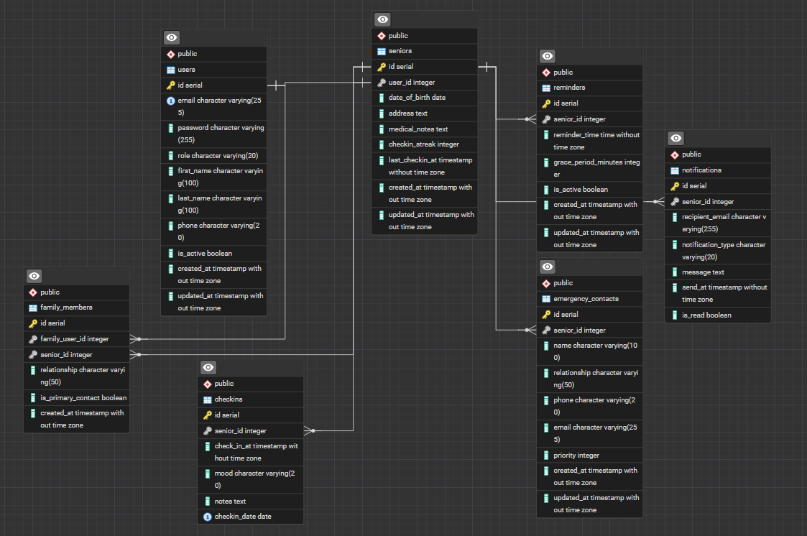

# 🏠 Elderly Checkin Application

A full-stack web application designed to support seniors living alone in Singapore. The system provides daily check-ins, missed check-ins alert to family members, emergency contact management, and a senior friendly user interface.

## 🏗️ About this Project

Built as a portfolio project to demonstrate full-stack data engineering and software development skills. Designed in real-world impact, and addressing the growing need for elderly care monitoring in SIngapore.

## ✨ Features

- ✅ Daily check-in with mood / wellness indicator
- ✅ Missed check-in alert to family members via email
- ✅ Emergency contact management
- ✅ Check-in history and streak checking
- ✅ Senior large friendly user interface
- ✅ Family dashboard to monitor elderly loves one
- ✅ Role based access (senior | family | admin)
- ✅ Scheduled daily reminder to senior for checkin in

## 🛠️ Tech Stacks Used

### Frontend

- React JS (VITE) with Typescript
- Tailwind CSS V4 (Styling)
- Axios (Making Http request)
- React Router DOM (Navigation Pages)

### Backend

- Node js with Express and Typscript
- PostgreSQL (Database)
- JWT Authentication (Secure login)
- Nodemailer (email alert)
- Node-cron (schedule reminder)
- Winston (logging)

## 🗄️ Database Schema

| Table                | Purpose                               |
| -------------------- | ------------------------------------- |
| `users`              | All accounts — seniors, family, admin |
| `seniors`            | Senior profile and check-in streak    |
| `family_members`     | Links family accounts to their senior |
| `emergency_contacts` | Emergency contacts per senior         |
| `checkins`           | Daily check-in records                |
| `reminders`          | Reminder schedule per senior          |
| `notifications`      | Alert history                         |



## 📁 Project Structure

```
elderly-checkin-app
|—— backend/
|   |—— logs/
|   |    └── app/            # App logs
|   |
|   |—— src/
|   |   |—— config/          # Database, logger, schema
|   |   |—— controllers/     # Business logic
|   |   |—— middleware/      # Auth middleware
|   |   |—— routes/          # API endpoints
|   |   |—— types/           # Typescript types
|   |   └── server.ts        # Entry point
|   |
|   |—— .env                 # Environment variables
|   |
|   └── tsconfig.json
|
|—— docs/                    # Documentation
|
|—— frontend/
|   |—— src/
|   |   |—— api/             # Axios instance
|   |   |—— components/      # Reusable UI
|   |   |—— context/         # Global state
|   |   |—— hooks/           # Custom hooks
|   |   |—— pages/           # Page components
|   |   |—— types/           # Typescript types
|   |   |—— utils/           # Reuseable functions
|   |   └── App.tsx          # Root component
|   |
|   └── .env                 # Environment variables
|
|—— .gitignore               # Folders or files not committed to GitHub
|
└── README.md                # Project guide

```

## 🚀 Getting Started

### Prerequisites

- Node.js v18+
- PostgreSQL v15+
- Git

### 1. Clone the repository

```bash
git clone https://github.com/janson-gan/elderly-check-in-system.git
cd elderly-checkin-system
```

### 2. Backend Setup

```bash
cd backend
npm install
```

Create a `.env` file in the `backend/` folder:

```env
PORT=5000
DB_HOST=localhost
DB_PORT=5432
DB_NAME=elderly_checkin
DB_USER=postgres
DB_PASSWORD=your_password_here
```

Start the backend:

```bash
npm run dev
```

### 3. Frontend Setup

```bash
cd frontend
npm install
```

Create a `.env` file in the `frontend/` folder:

```env
VITE_API_URL=http://localhost:5000
```

Start the frontend:

```bash
npm run dev
```

### 4. Access The App

- Frontend: http://localhost:5173
- Backend API: http://localhost:5000

## 🗺️ Development Roadmap

- [✔️] Phase 1 — Project foundation, database design, frontend skeleton
- [ ] Phase 2 — Authentication and user management
- [ ] Phase 3 — Check-in system and reminders
- [ ] Phase 4 — Missed check-in alerts and emergency contacts
- [ ] Phase 5 — UI polish, history, testing and deployment

## 👨‍💻 Author

Built by [Gan Boon Chai Janson] — Mid-career switcher transitioning into data engineering and full-stack development.

- GitHub: [@janson-gan](https://github.com/janson-gan)
- LinkedIn: [Janson Gan](https://www.linkedin.com/in/jansongan/)
